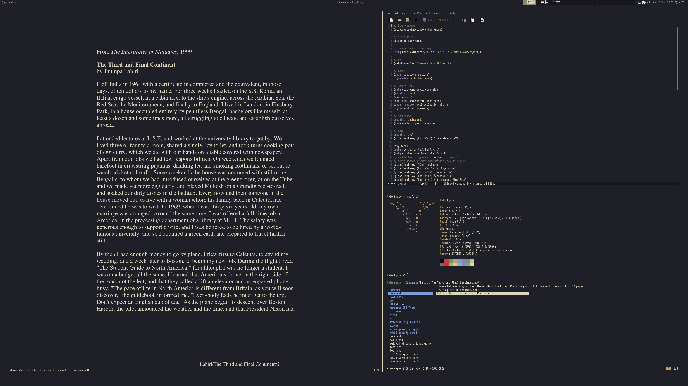

# Dotfiles
## my system config!

**Operating System:** [GNU Guix](https://guix.gnu.org/)

**Desktop Environment:** [Xfce](https://xfce.org/)

**Window Manager:** [xmonad](https://xmonad.org/)

**Text Editor:** [GNU Emacs](https://www.gnu.org/software/emacs/) with native-comp from [flatwhatson channel](https://github.com/flatwhatson/guix-channel)

**Terminal:** [Kitty](https://sw.kovidgoyal.net/kitty/)

**Font:** [Iosevka Term](https://typeof.net/Iosevka/)

**Theme:** [Kanagawa](https://github.com/rebelot/kanagawa.nvim)

These dotfiles are for my desktop. In terms of keyboard, I use the QWERTY layout with a NiZ Plum Atom 68. I hope to learn DVORAK one of these days.
